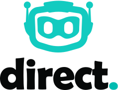

# @direct.dev/ethers

<div align="center">
  <p>
    <a href="https://direct.dev/">
      <picture>
        <source media="(prefers-color-scheme: dark)" srcset="media/logo-white-duo.svg">
        
      </picture>
    </a>
  </p>

  <p>
    <a href="https://www.npmjs.com/package/@direct.dev/ethers"></a>
    <a href="https://bundlephobia.com/package/@direct.dev/ethers"></a>
    <a href="./LICENSE.md"></a>
  </p>
</div>

An **ethers**-compatible provider that integrates with the [Direct.dev](https://direct.dev/) RPC infrastructure, providing **read-layer caching** for improved performance and reduced costs.

## Features

- 🚀 **Optimized RPC calls** via Direct.dev
- 🔌 **Drop-in replacement** for your existing Ethers providers
- 🛡 **Dependency-free**, ensuring security and stability
- 📉 **Lower latency and costs** with efficient request routing

## Installation

```sh
npm install @direct.dev/ethers ethers
# or
yarn add @direct.dev/ethers ethers
# or
pnpm add @direct.dev/ethers ethers
```

## Usage

```ts
// Import dependencies
import DirectProvider from "@direct.dev/ethers";

// Initialize the Direct.dev provider
const provider = new DirectProvider({
  projectId: "your-project-id", // From the Direct.dev dashboard
  projectToken: "************", // From the Direct.dev dashboard
  networkId: "your-network-id", // e.g. "ethereum", "polygon"
  failover: ["https://your-provider-endpoints.com/"],
});

// Example: Fetch the latest block number
const blockNumber = await provider.getBlockNumber();
```

## Documentation

For full API reference and detailed usage guides, visit our [official documentation](https://direct.dev/docs/).

## Support

Join our [Discord community](https://discord.gg/directdotdev) for discussions and support.

## License

🛡️ **License:** This software is provided under the [Direct.dev Terms and Conditions](./LICENSE.md).  
Use of this software requires agreement to those terms.

For inquiries, contact [info@direct.dev](mailto:info@direct.dev).
