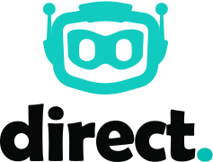

# @direct.dev/web3

<div align="center">
  <p>
    <a href="https://direct.dev/">
      <picture>
        <source media="(prefers-color-scheme: dark)" srcset="media/logo-white-duo.svg">
        
      </picture>
    </a>
  </p>

  <p>
    <a href="https://www.npmjs.com/package/@direct.dev/web3"></a>
    <a href="https://bundlephobia.com/package/@direct.dev/web3"></a>
    <a href="https://github.com/direct-dev-project/direct-dev-client/blob/main/LICENSE"></a>
  </p>
</div>

A `web3.js`-compatible provider that integrates with the [Direct.dev](https://direct.dev/) RPC infrastructure, providing **read-layer caching** for improved performance and reduced costs.

## Features

- 🚀 **Optimized RPC calls** via Direct.dev
- 🔌 **Drop-in replacement** for your existing Web3 providers
- 🛡 **Dependency-free**, ensuring security and stability
- 📉 **Lower latency and costs** with efficient request routing

## Installation

```sh
npm install @direct.dev/web3
# or
yarn add @direct.dev/web3
# or
pnpm add @direct.dev/web3
```

## Usage

```ts
// Import dependencies
import Web3 from "web3";
import { DirectWeb3Provider } from "@direct.dev/web3";

// Initialize the Direct.dev provider
const provider = new DirectWeb3Provider({
  projectId: "your-project-id", // From the Direct.dev dashboard
  projectToken: "*****", // From the Direct.dev dashboard
  networkId: "your-network-id", // e.g. "ethereum", "polygon"
  providers: ["https://your-provider-endpoint.com/"],
});

// Create a Web3 instance using the Direct provider
const web3 = new Web3(provider);

// Example: Fetch the latest block number
const blockNumber = await web3.eth.getBlockNumber();
```

## Documentation

For full API reference and detailed usage guides, visit our [official documentation](https://direct.dev/docs/).

## Contributing

We welcome contributions! If you find a bug or have an improvement, feel free to open an issue or submit a pull request.

## Support

Join our [Discord community](https://discord.gg/directdotdev) for discussions and support.

## License

This project is licensed under the [MIT License](https://github.com/direct-dev-project/direct-dev-client/blob/main/LICENSE).
